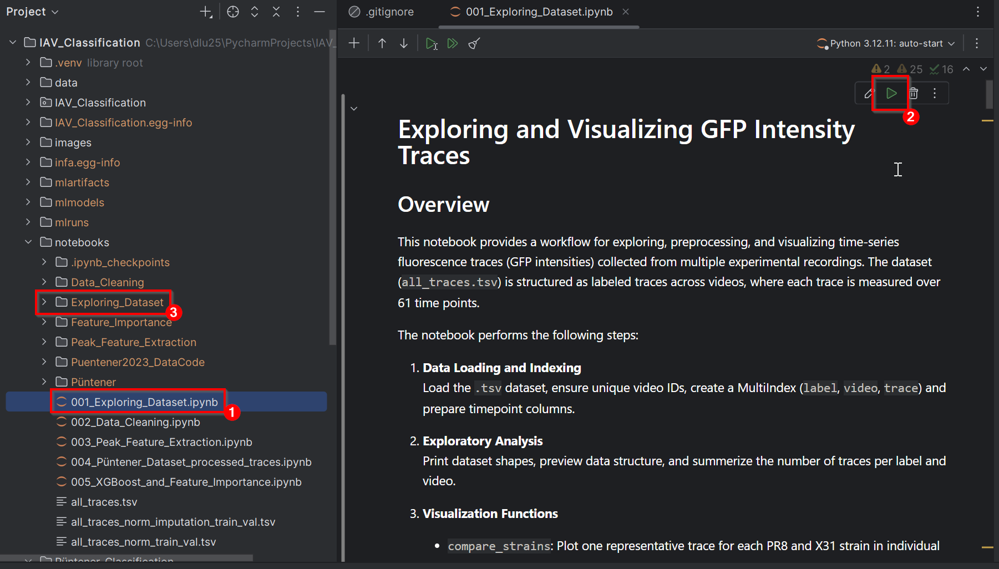

# IAV Classification
Description (ca. 4 Zeilen)

## Contents
1. **notebooks**  
    -> 5 Scripts that carry out visualizing and preprocessing steps
2. **IAV_Classification**  
    -> Classical ML. Dataset Split, Augmentation, Train, Evaluation, Test and Prediction
3. **Püntener**  
    -> Scripts and datasets for reproducing the Püntener & Rivera-Fuentes 'Blinkognition' paper and scaling experiments.

## Installation
Please install [uv](https://docs.astral.sh/uv/getting-started/features/) if you want to use this code.
It uses [typer](https://typer.tiangolo.com/) as a command line interface and [MLflow](https://mlflow.org/docs/latest/ml/tracking/quickstart/) for tracking the experiments.
```bash
# clone the Git Repository
git clone https://github.com/denlukas/IAV_Classification.git
# change into IAV_Classification directory
cd IAV_Classification
# install the dependencies
uv sync
#activate the environment
source .\.venv\Scripts\Activate.ps1
# or
. .\.venv\Scripts\Activate.ps1 
```

## Getting started

### Notebooks

To carry out the preprocessing steps open the notebooks folder and double click on the notebook (1).
The next step is to run the cells, which will get executed by clicking on `Run Section` (2).
The notebooks will automatically create output folders such as `Exploring_Dataset` (3).
Each notebook will have an individual overview of how to use the notebook, what inputs are needed and what outputs are generated.

### How to start MLflow

First, open the terminal on the left side of the menu (1).  
To start the MLflow server it is advised to open another terminal. For this, just click on the "+" and rename the terminal as u wish (2).  
Now you can execute the following command:  
```bash
mlflow server --host 127.0.0.1 --port 5001 --serve-artifacts
```
Click on the link that is provided and you will be forwarded to the MLflow Webinterface (3).  


You will see a list of experiments (usually infa and Default). Choose infa and in the next step click on chart interface (1).  
For better overview in these charts you can select "settings" (2) and set the line smoothing to 70 (3), so the lines look more stable and clear.  
In the chart interface you will see all runs and charts for the training and validation metrics, such as loss, val_loss and val_mcc. 
You can drag the metric windows up and down by clicking on the six dots (4).
It is advised to pin loss, val_loss and val_mcc on top, as they are the most important metrics. 


You can hide runs by clicking on the eye (1) and also change the run color by clicking on the colored circle (2).


By clicking on a specific run you will get information about this model, such as the Run ID (1), which is important for later functions.

### How to make predictions
If new data is collected, you can use the prediction function to predict the classes of the new collected data.
```bash
# Function 1:
uv run app predict-labeled runs:/ffa0a5a69ef3495d8efad876a76f1797/DIOR_SS13_Kinga all_traces_predict.tsv predictions_labeled.tsv
# or
uv run app predict-labeled runs:/ffa0a5a69ef3495d8efad876a76f1797/DIOR_SS13_Kinga all_traces_predict.tsv predictions_labeled.tsv --threshold 0.6

# Function 2:
uv run app predict-unlabeled runs:/ffa0a5a69ef3495d8efad876a76f1797/DIOR_SS13_Kinga all_traces_predict.tsv predictions_unlabeled.tsv 
# or
uv run app predict-unlabeled runs:/ffa0a5a69ef3495d8efad876a76f1797/DIOR_SS13_Kinga all_traces_predict.tsv predictions_unlabeled.tsv --threshold 0.6
```

A file will be created and saved as either `predictions_labeled.tsv` or `predictions_unlabeled.tsv` (depending on which function is used)
Each prediction is a single scalar in [0, 1]. 
It represents the confidence that the input belongs to one specific class (here "PR8").
The complementary probability (for "X31") would just be `1 - y_pred_prob`. 
If the model is >50% confident it’s class "PR8", call it "PR8", otherwise it calls "X31".
If the dataset is balanced a default threshold of 0.5 is great, but if the new dataset is still unbalanced it better to increase the threshold, so that the model is a bit more cautious before calling a trace as "PR8".

### How to train and evaluate new models
To train new models an example is provided below based on the all_traces.tsv dataset. 
```bash
# Step 1: Create train and test set
uv run app create-test-set all_traces_norm_imputation_without_background.tsv --seed 132 --fold 4
# or if you dont want to use augmentation
uv run app create-test-set all_traces_norm_imputation_without_background.tsv --seed 132 --fold 4 --no-augment
```
A Stratified Group K-fold is plotted so you can choose which fold fits the best to the class proportions in the dataset.
To find a suitable fold it could take some tries by changing the seeds and folds, depending on the class proportions.  
If the dataset exhibits an 1:2 class proportion choose a split that exhibits an 1:2 proportion. 
If the dataset exhibits an 1:1 class proportion choose a split that exhibits an 1:1 proportion.
You get the gist.

```bash
# Step 2: Train the model
uv run app train --dataset all_traces_norm_imputation_without_background_train_val.tsv --run-name DIOR_SS13 --seed 132 --fold 4
# or
uv run app train --dataset all_traces_norm_imputation_without_background_train_val.tsv --run-name DIOR_SS13 --seed 132 --fold 4 --patience 0
# select the created _train_val.tsv file and also provide a run name and use the same seed and fold as during create-test-set
# Now you monitor the training and validation of the train file on MLflow
# --patience 0 means that early stopping is deactivated and the training will last 1000 epochs
```

During training it is important to choose a model that generalizes well on the validation set.
Try not to select models that exhibit over- or underfitting.
Both `loss` and `val_loss` should go down during training and validation. 
A decrease in training loss indicates that the model is successfully learning patterns from the training data. 
A corresponding decrease in validation loss suggests that this learned knowledge generalizes to unseen data in the validation set.
The `val_mcc` should go up. The higher the mcc, the better the model can distinguish between the classes. 

[Insert photos for over- and underfitting]

This is also your chance to optimize and change hyperparameters in the `model.py`(IAV_Classification/model.py) file based on the training results.
You think the model could use less capacity? Lower the number of filters in the kernels

```bash
# Step 3: Evaluate the model
uv run app evaluate runs:/8bea29fda5cf4f1a81e489e6d1b108f8/DIOR_SS13_Kinga --dataset all_traces_norm_imputation_without_background_train_val.tsv --seed 132 --fold 4
# or
uv run app evaluate runs:/ffa0a5a69ef3495d8efad876a76f1797/DIOR_SS13_Kinga --dataset all_traces_norm_imputation_without_background_train_val.tsv --seed 132 --fold 4 --ct-threshold 0.1
# insert the Run ID and run name of the model here
# the first command will create an evaluation report including a confusion matrix, ROC and PR curves and a classification report
# by adding --ct-threshold to the second code it creates an evaluation and post-processing evaluation report.
```
The post-processing evaluation will provide you with an evaluation report, a ct-thresholding report, a Wasserstein distance plot, an ECDF of class fractions, a barplot of the class fractions and 4 post-processing reports with higher getting CTs.
The number of traces included in the confusion matrices will probably decrease with each CT and the accuracy should (in the best case) increase. 

```bash
# Step 4: Use the held back test file
uv run app test runs:/ffa0a5a69ef3495d8efad876a76f1797/DIOR_SS13_Kinga --dataset all_traces_norm_imputation_without_background_test.tsv
# or
uv run app test runs:/ffa0a5a69ef3495d8efad876a76f1797/DIOR_SS13_Kinga --dataset all_traces_norm_imputation_without_background_test.tsv --ct-threshold 0.1
```

These commands work the same way as the `evaluate` function

```bash
# Step 5: Prediction

# Function 1:
uv run app predict-labeled runs:/ffa0a5a69ef3495d8efad876a76f1797/DIOR_SS13_Kinga all_traces_predict.tsv predictions_labeled.tsv
# or
uv run app predict-labeled runs:/ffa0a5a69ef3495d8efad876a76f1797/DIOR_SS13_Kinga all_traces_predict.tsv predictions_labeled.tsv --threshold 0.6

# Function 2:
uv run app predict-unlabeled runs:/ffa0a5a69ef3495d8efad876a76f1797/DIOR_SS13_Kinga all_traces_predict.tsv predictions_unlabeled.tsv 
# or
uv run app predict-unlabeled runs:/ffa0a5a69ef3495d8efad876a76f1797/DIOR_SS13_Kinga all_traces_predict.tsv predictions_unlabeled.tsv --threshold 0.6
```

See `How to make predictions` for the description.

## References
add link to a paper if one exists