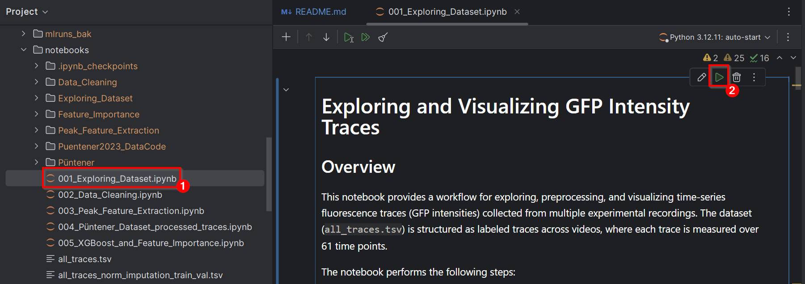
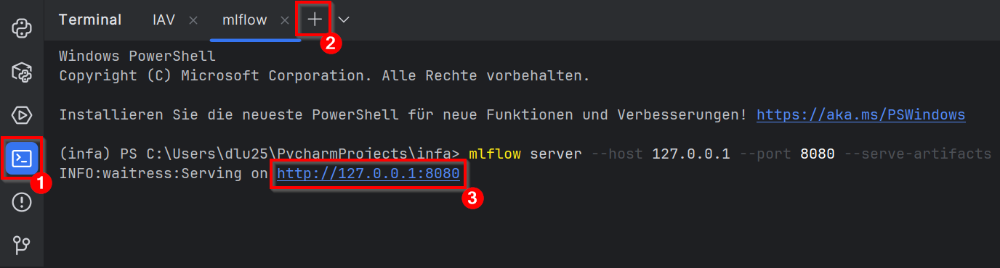
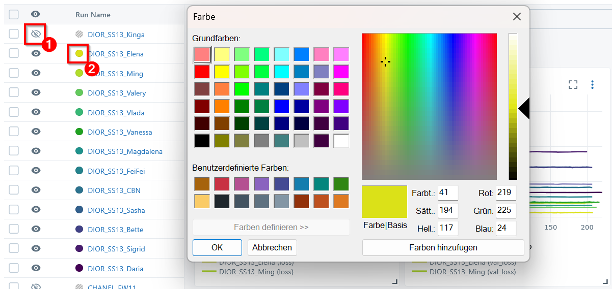
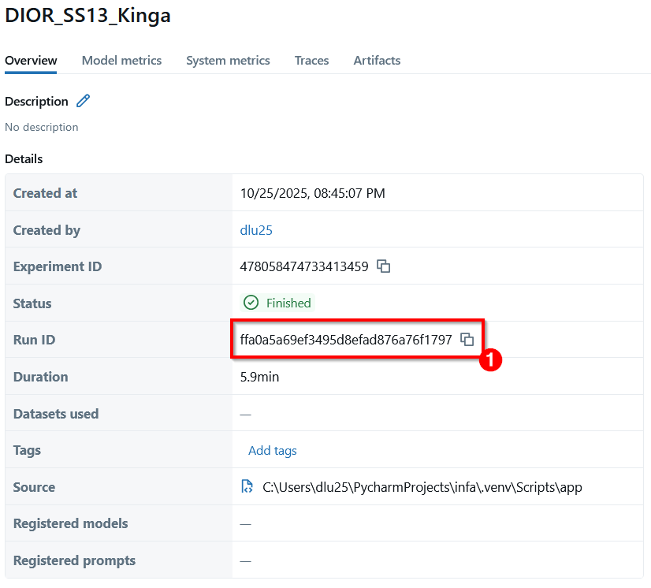
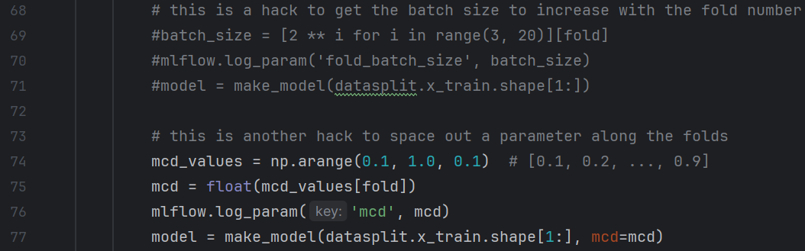
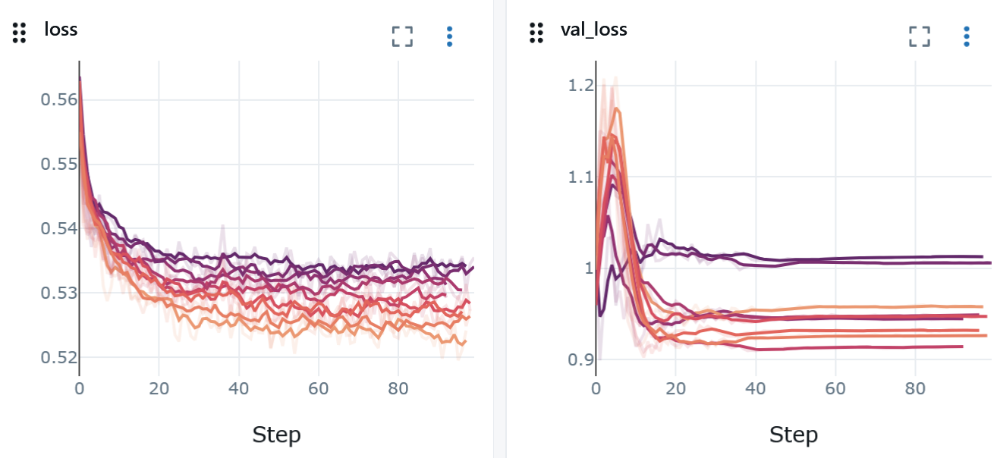
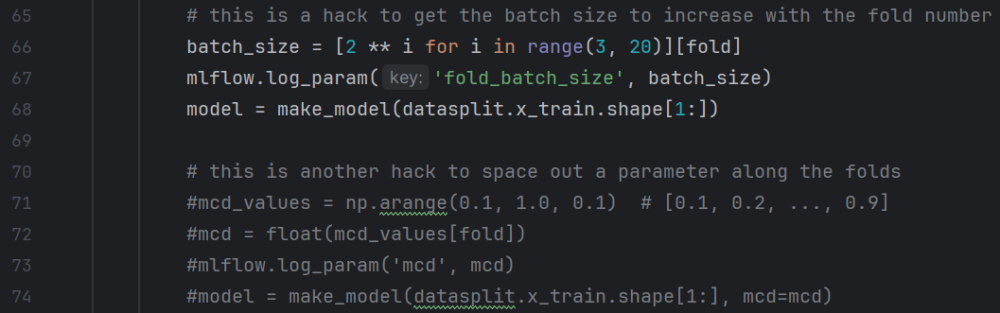

# IAV Classification
The IAV Classification project is a machine learning–based time-series pipeline for classifying strain-specific clathrin-mediated endocytosis dynamics of Influenza A (PR8 vs X31) from TIRF-derived fluorescence traces.
It integrates robust preprocessing steps (normalization, cleaning, imputation, background subtraction) with a Keras 1D-CNN and Monte Carlo Dropout for uncertainty estimation, followed by a certainty-threshold post-analysis using the minimal Wasserstein distance. 
The project also reproduces and scales the Blinkognition single-molecule pipeline established by Püntener and Rivera-Fuentes to examine how temporal resolution and dataset size affect model stability and performance, and to validate the integration of their certainty-threshold post-analysis.

## Contents
1. **notebooks**  
    -> 5 Scripts that carry out visualizing and preprocessing steps
2. **IAV_Classification**  
    -> Classical ML. Dataset Split, Augmentation, Train, Evaluation, Test and Prediction
3. **blinkognition**  
    -> Scripts and datasets for reproducing the Püntener & Rivera-Fuentes 'Blinkognition' paper and scaling experiments.

## Installation
Please install [uv](https://docs.astral.sh/uv/getting-started/features/) if you want to use this code.
It uses [typer](https://typer.tiangolo.com/) as a command line interface and [MLflow](https://mlflow.org/docs/latest/ml/tracking/quickstart/) for tracking the experiments.
```bash
# clone the Git Repository
git clone https://github.com/denlukas/IAV_Classification.git
# change into IAV_Classification directory
cd IAV_Classification
# install the dependencies
uv sync
#activate the environment
source .\.venv\Scripts\Activate.ps1
```

## Getting started
The preprocessing steps are carried out in the `notebooks` folder. Notebooks included are: 001_Exploring_Dataset, 002_Data_Cleaning, 003_Peak_Feature_Extraction, 004_Püntener_Dataset_processed_traces and 005_XGBoost_and_Feature_Importance. 
The notebooks can be carried out by opening the notebook (1) and clicking on `Run Section`(2).
Outputs will be created automatically. Each notebook creates an individual output folder.



### How to start MLflow

First, open the terminal on the left side of the menu (1).  
To start the MLflow server it is advised to open another terminal. For this, just click on the "+" and rename the terminal as u wish (2).  
Now you can execute the following command:  
```bash
mlflow server --host 127.0.0.1 --port 8080 --serve-artifacts
```
Click on the link that is provided and you will be forwarded to the MLflow Webinterface (3).  


You will see a list of experiments (usually iav_classification, blinkognition and Default). Choose infa and in the next step click on chart interface (1).  
For better overview in these charts you can select "settings" (2) and set the line smoothing to 70 (3), so the lines look more stable and clear.  
In the chart interface you will see all runs and charts for the training and validation metrics, such as loss, val_loss and val_mcc. 
You can drag the metric windows up and down by clicking on the six dots (4).
It is advised to pin loss, val_loss and val_mcc on top, as they are the most important metrics. 


You can hide runs by clicking on the eye (1) and also change the run color by clicking on the colored circle (2).


By clicking on a specific run you will get information about this model, such as the Run ID (1), which is important for later functions.

## IAV Classification
### How to make predictions
If new data is collected, you can use the prediction function to predict the classes of the new collected data.
Prepare the dataset with `trace` as first column, followed by the time series columns with `time_0`, `time_10`, etc for the first prediction function.
The first example sets the default threshold at 0.5, while the second example let's you set a threshold.
The threshold is the decision cutoff used to convert probabilities into binary predictions. It determines how confident the model must be before calling a sample “PR8” instead of “X31.”
A threshold of e.g. 0.6 means that the model must be at least 60% confident that a sample belongs to the PR8 class before labeling it as PR8. 
Any prediction with a probability ≤ 0.6 will instead be labeled as X31.
(Optional) To check how accurate the predictions were, load a labeled dataset with `class`, `video_ID` and `trace` as first three columns, followed by the time series columns with `time_0`, `time_10`, etc.
Save both datasets in the `data` folder.
You can run the predictions with:
```bash
# Function 1:
uv run app ml predict-unlabeled runs:/ffa0a5a69ef3495d8efad876a76f1797/DIOR_SS13_Kinga all_traces_unlabeled.tsv 
# or
uv run app ml predict-unlabeled runs:/ffa0a5a69ef3495d8efad876a76f1797/DIOR_SS13_Kinga all_traces_unlabeled.tsv --threshold 0.6

# Function 2:
uv run app ml predict-labeled runs:/ffa0a5a69ef3495d8efad876a76f1797/DIOR_SS13_Kinga all_traces_labeled.tsv
# or
uv run app ml predict-labeled runs:/ffa0a5a69ef3495d8efad876a76f1797/DIOR_SS13_Kinga all_traces_labeled.tsv --threshold 0.6
```
A .tsv file will be created in the 'IAV_output folder'

### How to train and evaluate new models
#### Create a train and test set 
To train new models save datasets derived from the preprocessing pipeline in the `data` folder with `class`, `video_ID` and `trace` as first three columns, followed by the time series columns with `time_0`, `time_10`, etc.
An example is provided below based on the `all_traces.tsv` dataset. 
```bash
# Step 1: Create train and test set
uv run app data create-test-set all_traces_norm_imputation_without_background.tsv --seed 132 --fold 4
# or if you dont want to use augmentation
uv run app data create-test-set all_traces_norm_imputation_without_background.tsv --seed 132 --fold 4 --no-augment
```
A Stratified Group K-fold is plotted so you can choose which fold fits the best to the class proportions in the dataset.
To find a suitable fold it could take some tries by changing the seeds and folds.  
If the dataset exhibits an 1:2 class proportion choose a train/test split that exhibits an 1:2 proportion. 
If the dataset exhibits an 1:1 class proportion choose a train/test split that exhibits an 1:1 proportion.
The split will generate two files `*_train_val.tsv` and `*_test.tsv`.
Datasets and splits for all preprocessing techniques are already provided in the `data` folder.

#### Train a model
The next step is to train a model. Load the `*_train_val.tsv` dataset. The train function splits the dataset in train and validation sets.
Again, find a suitable class proportion, which could take some tries. Press `Strg`+`c` to stop training, if the class proportions are not suitable and repeat with a different seed and/or fold.
```bash
# Step 2: Train the model
uv run app ml train --dataset all_traces_norm_imputation_without_background_train_val.tsv --run-name DIOR_SS13 --seed 132 --fold 4
# or
uv run app ml train --dataset all_traces_norm_imputation_without_background_train_val.tsv --run-name DIOR_SS13 --seed 132 --fold 4 --patience 0
# select the created _train_val.tsv file and also provide a run name and use the same seed and fold as during create-test-set
# Now you can monitor the training and validation of the train file on MLflow
# --patience 0 means that early stopping is deactivated and the training will last 1000 epochs
```
During training it is important to choose a model that generalizes well on the validation set.
You can monitor the training on MFflow now.
Try not to select models that exhibit over- or underfitting.
Both `loss` (training error) and `val_loss` (test error) should go down during training and validation. 
A decrease in training loss indicates that the model is successfully learning patterns from the training data. 
A corresponding decrease in validation loss suggests that this learned knowledge generalizes to unseen data in the validation set.
The `val_mcc` should go up. The higher the mcc, the better the model can distinguish between the classes. 


[Source: https://vitalflux.com/overfitting-underfitting-concepts-interview-questions/]

#### Optimize the model
This is also your chance to optimize and change hyperparameters in the `model.py`(IAV_Classification/model.py) file based on the training results.
You think the model could use less capacity? Lower the number of filters in the kernels
With the `cross_validate` function you can also see how the model performs with increasing batch sizes or Monte Carlo Dropout.
To monitor the performance of models with increasing mcd values check if the `cv.py` file looks like this:


You call the function with:
```bash
# Step 3.1: Change parameters
uv run app cv cross-validate all_traces_norm_imputation_without_background_train_val.tsv --run-name test_mcd --n-jobs 8 --n-folds 8 --epochs 100 --palette "flare" --seed 42
```
Calling `n-jobs 9` & `n-folds 9` means that 9 runs are running at the same time, generating one mcd value per fold (0.1, 0.2, 0.3, ..., 0.9). You can also set it to `n-jobs 2`, so two runs are running at the same time four times. 
Setting `n-folds 4` for example creates 4 mcd values (0.1, 0.2, 0.3 and 0.4). Usually lower mcd values will have the lowest loss values (orange lines), while higher mcd values will have higher loss values (purple lines).
This is because the random dropout of neurons. A mcd value of 0.1 only randomly drops out a small number of neurons, which means that the model memorizes better. These models most likely won't generalize too well to new data. A mcd value of 0.9 will randomly dropout a high amount of neurons during training, which means that the model won't memorize well.
This results in higher loss values, meaning the model does not learn too well. In most cases, mcd values of 0.4-0.6 generalize the best.



To monitor the performance of models with increasing batch sizes check if the `cv.py` file looks like this:


You call the function with:
```bash
# Step 3.2: Change parameters
uv run app cv cross-validate all_traces_norm_imputation_without_background_train_val.tsv --run-name test_batch_size --n-jobs 8 --n-folds 8 --epochs 100 --palette "flare" --seed 42
```
Calling `n-jobs 8` & `n-folds 8` means that 8 runs are running at the same time, generating one batch size per fold (8, 16, 32, 64, 128, 256, 512, 1024 and 2048).  
Setting `n-folds 4` for example creates 4 batch sizes (8, 16, 32 and 64,). Usually lower batch sizes will take longer to train the model (orange lines), as each update per epoche sees only a small subset of data, while higher batch sizes will train models faster (purple lines), as each update sees a high subset of data.
Smaller batch sizes (8, 16, 32) usually generalize better, while higher batch sizes (512, 1024, 2048) do not generalize that well.


#### Evaluate the model on the validation set
After optimizing the model architecture, the model can be evaluated with this function:
```bash
# Step 4: Evaluate the model
# insert the Run ID and run name of the model derived from the MLflow webinterface here
uv run app ml evaluate runs:/ffa0a5a69ef3495d8efad876a76f1797/DIOR_SS13_Kinga --dataset all_traces_norm_imputation_without_background_train_val.tsv --seed 132 --fold 4 --no-include-uncertainty --no-use-post-analysis --no-spaced-threshold
# or
uv run app ml evaluate runs:/ffa0a5a69ef3495d8efad876a76f1797/DIOR_SS13_Kinga --dataset all_traces_norm_imputation_without_background_train_val.tsv --seed 132 --fold 4 --ct-threshold 0.1
```
There are two different calls. The first call evaluates the model without a post-processing pipeline, while the second call includes a post-processing pipeline.
The post-processing evaluation will provide you with an evaluation report, a ct-thresholding report, a Wasserstein distance plot, an ECDF of class fractions, a barplot of the class fractions and 4 post-processing reports with higher getting CTs.
The ct_threshold sets the minimum confidence level (based on the minimal Wasserstein distance from Monte Carlo predictions) above which samples are kept for evaluation, filtering out uncertain predictions.
The number of traces included in the confusion matrices will probably decrease with each CT and the accuracy should (in the best case) increase. 

#### Evaluate the model on the test set
These next commands work the same way as the `evaluate` function calls, but use the held back test dataset, instead of the validation set.
```bash
# Step 5: Use the held back test file
uv run app ml test runs:/ffa0a5a69ef3495d8efad876a76f1797/DIOR_SS13_Kinga --dataset all_traces_norm_imputation_without_background_test.tsv --no-include-uncertainty --no-use-post-analysis --no-spaced-threshold
# or
uv run app ml test runs:/ffa0a5a69ef3495d8efad876a76f1797/DIOR_SS13_Kinga --dataset all_traces_norm_imputation_without_background_test.tsv --ct-threshold 0.1
```

#### Make predictions with a new dataset
The last step is to make predictions on a new unseen dataset, that is either unlabeled or labeled.
See more information about predictions in `How to make predictions`.
```bash
# Step 6: Prediction

# Function 1:
uv run app ml predict-labeled runs:/ffa0a5a69ef3495d8efad876a76f1797/DIOR_SS13_Kinga all_traces_labeled.tsv
# or
uv run app ml predict-labeled runs:/ffa0a5a69ef3495d8efad876a76f1797/DIOR_SS13_Kinga all_traces_labeled.tsv --threshold 0.6

# Function 2:
uv run app ml predict-unlabeled runs:/ffa0a5a69ef3495d8efad876a76f1797/DIOR_SS13_Kinga all_traces_unlabeled.tsv 
# or
uv run app ml predict-unlabeled runs:/ffa0a5a69ef3495d8efad876a76f1797/DIOR_SS13_Kinga all_traces_unlabeled.tsv --threshold 0.6
```

## Püntener Classification
This classification is a shorter pipeline, as this was only used for scaling and reproduction experiments. It does not include `test` or `prediction` functions.
#### Create a train and test set
To train new models save the created dataset derived from notebook `004_Püntener_Dataset_processed_traces` in the `data_blinko` folder.
An example is provided below based on the `E1_E2_zscored_filtered_traces_dataset_1x_61TPs.tsv` dataset. 
```bash
# Step 1: Create train and test set
uv run blinko-app data create-test-set E1_E2_zscored_filtered_traces_dataset_1x_61TPs.tsv --seed 42 --no-augment
```
The split will generate two files `*_train_val.tsv` and `*_test.tsv`.
This dataset and the splits are already provided in the `data_blinko` folder.

#### Train a model
The next step is to train a model. Load the `*_train_val.tsv` dataset. The train function splits the dataset in train and validation sets.
```bash
# Step 2: Train the model
uv run blinko-app ml train --dataset E1_E2_zscored_filtered_traces_dataset_1x_61TPs_train_val.tsv --run-name COURRÉGES_FW24 --seed 42
# or
uv run blinko-app ml train --dataset E1_E2_zscored_filtered_traces_dataset_1x_61TPs_train_val.tsv --run-name COURRÉGES_FW24 --seed 42 --patience 0
# select the created _train_val.tsv file and also provide a run name and use the same seed and fold as during create-test-set
# Now you can monitor the training and validation of the train file on MLflow
# --patience 0 means that early stopping is deactivated and the training will last 1000 epochs
```
Either train the model on a basesline architecture or the Püntener architecture. Changes in the model architecture can be carried out in the `ml.py` script in the `blinkognition` folder.

#### Evaluate the model on the validation set
After choosing a model architecture, the model can be evaluated with this function:
```bash
# Step 3: Evaluate the model
uv run blinko-app ml evaluate runs:/84bfd63f188943f7a24731955ffb62df/COURRÉGES_FW24 --dataset E1_E2_zscored_filtered_traces_dataset_1x_61TPs_train_val.tsv --seed 42 --no-include-uncertainty --no-use-post-analysis --no-spaced-threshold
# or
uv run blinko-app ml evaluate runs:/84bfd63f188943f7a24731955ffb62df/COURRÉGES_FW24 --dataset E1_E2_zscored_filtered_traces_dataset_1x_61TPs_train_val.tsv --seed 42 --ct-threshold 0.7
# insert the Run ID and run name of the model here
# the first command will create an evaluation report including a confusion matrix, ROC and PR curves and a classification report
# by adding --ct-threshold to the second code it creates an evaluation and post-processing evaluation report.
```
There are two different calls. The first call evaluates the model without a post-processing pipeline, while the second call includes a post-processing pipeline.
The post-processing evaluation will provide you with an evaluation report, a ct-thresholding report, a Wasserstein distance plot, an ECDF of class fractions, a barplot of the class fractions and 4 post-processing reports with higher getting CTs.
The number of traces included in the confusion matrices will probably decrease with each CT and the accuracy should (in the best case) increase. 

## References
add link to a paper if one exists